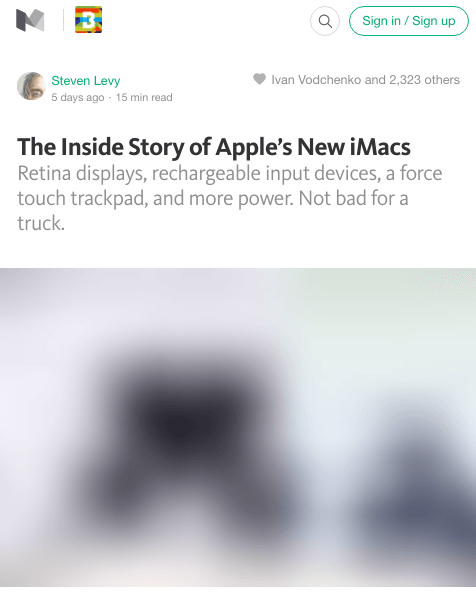

# How Medium does progressive image loading
> [原文地址](https://jmperezperez.com/medium-image-progressive-loading-placeholder/)

最近我在浏览Medium上的文章时注意到一个很赞的图片加载效果。首先加载一张模糊的小图，然后过渡到大图。我发现这是一种非常优雅的处理方式，并且想剖析一下这是如何实现的。

## Medium’s technique
为了展示Medium的图片加载是如何工作的，我们最好来看下示例：
<!-- [实例图片](./img/medium-progressive-loading.mp4) -->
<video controls="" style="max-width:100%" width="854" height="480"><source src="./static/video/medium-progressive-loading.mp4" type="video/mp4"></video>
